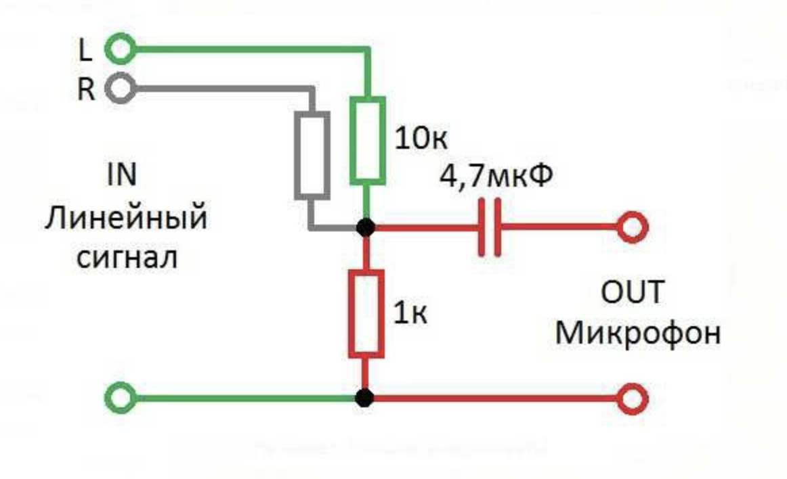
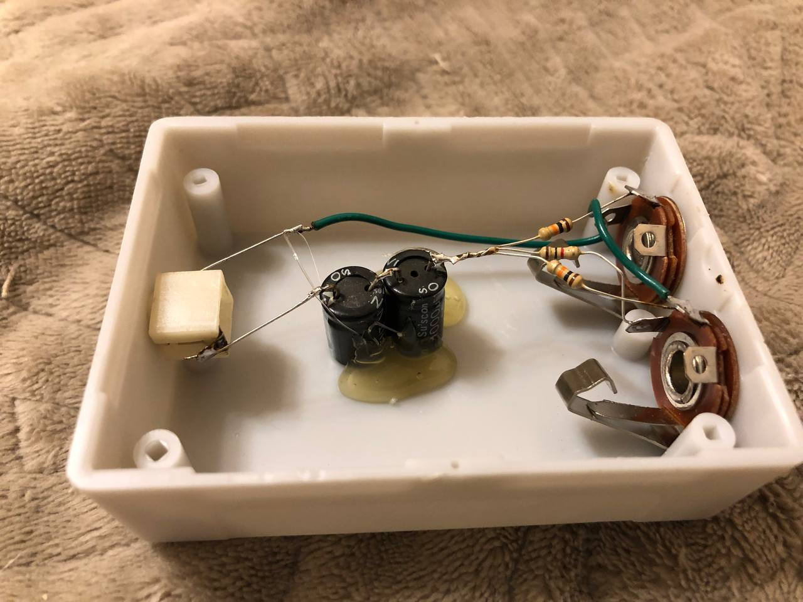
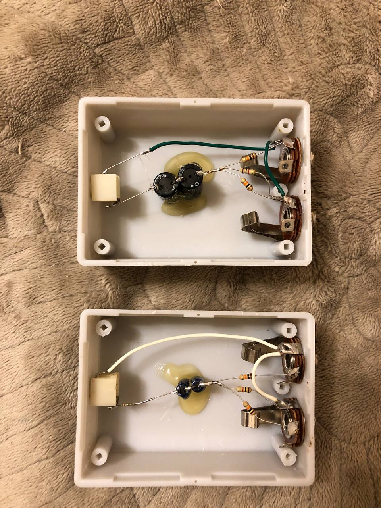
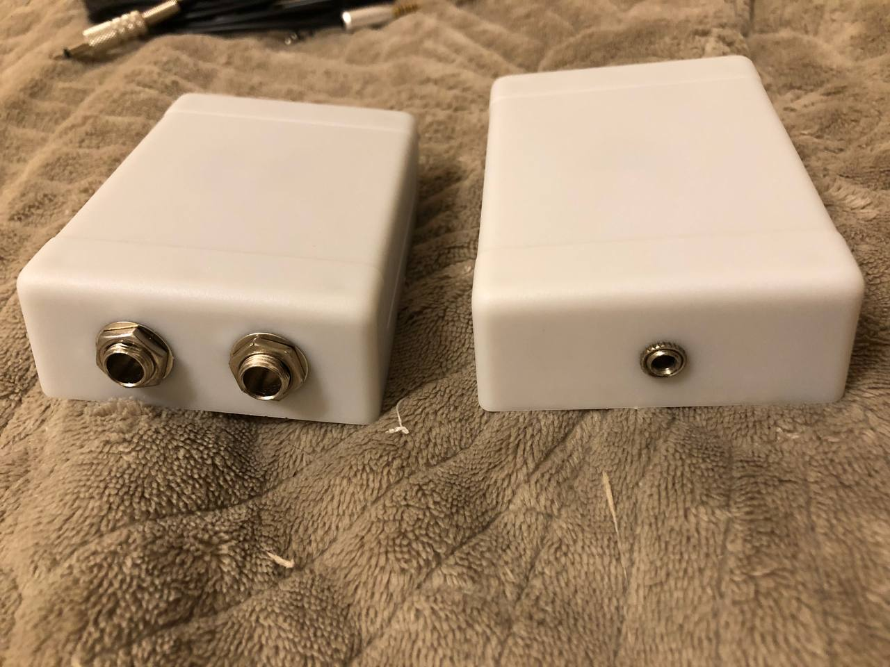
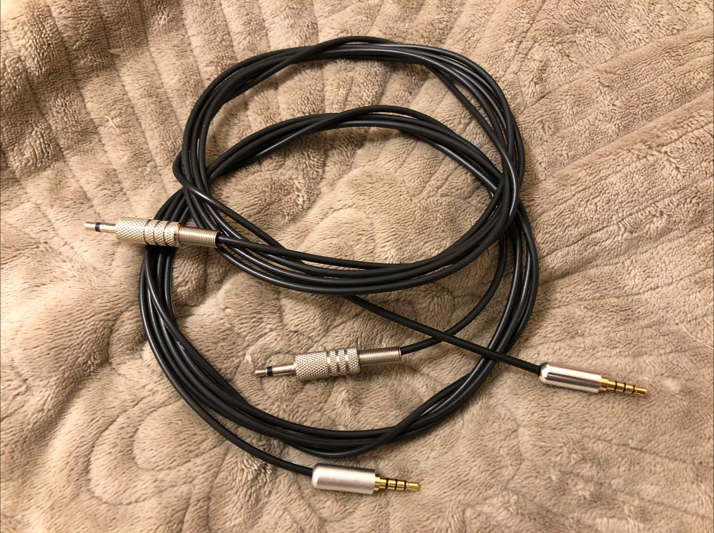
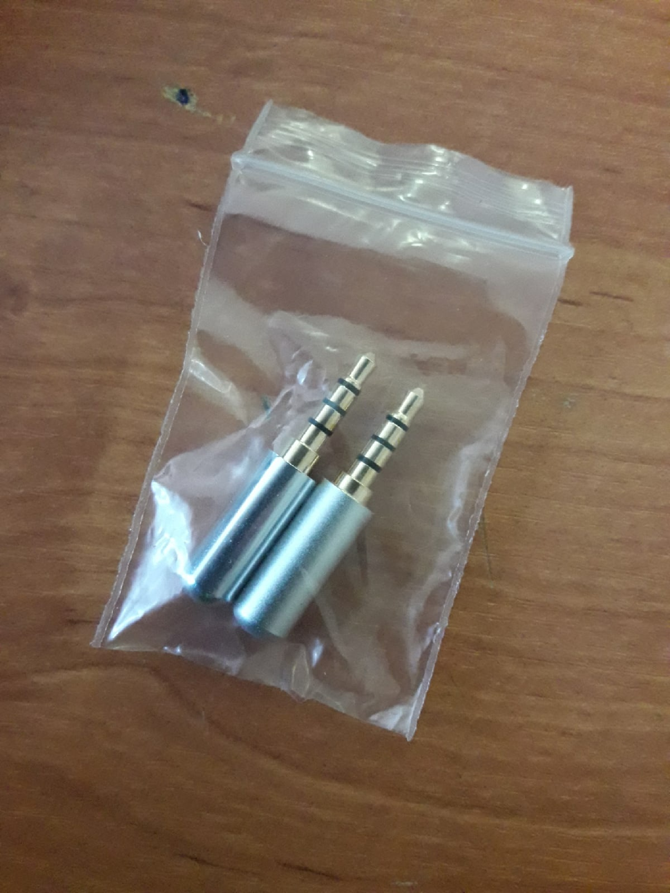
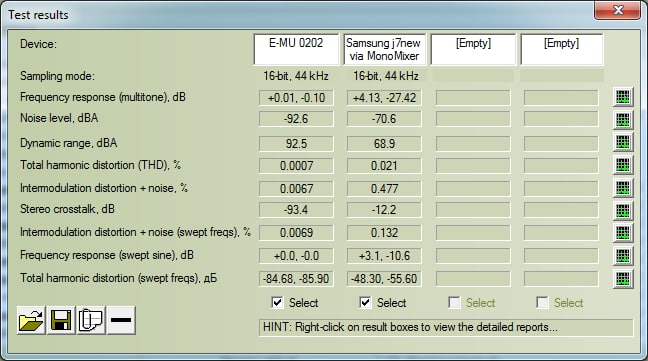
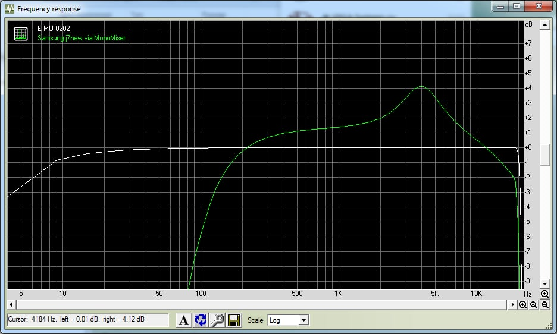
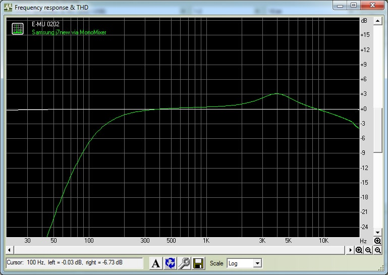
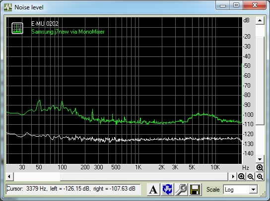

# low-cost-streamer

A device for connecting a line signal (from mixer, synth, line out, mp3 playes, phone etc) to the microphone input of an Android smartphone.

# Table of Contents
1. [Parameters](#Parameters)
2. [Scheme](#Scheme)
3. [Production secrets](#Production-secrets)
4. [Mesurements](#Mesurements)
5. [Conclusions](#Conclusions)

## Parameters

MONO ONLY !!!

A technical limitation related to the fact that all microphone inputs of smartphones are designed for a headset with one microphone.

## Scheme

Body

## Production secrets

A capacitor is a pair of electrolytes turned towards. Input Large JackTRS - MONO. Output mini jack mono. Cable: mono jack <---> TRRS.

Important! It is very difficult to find "true" mini jack plugs to fit your smartphone!

## Mesurements

Typical technical characteristics when working on a typical Samsung j7 neo smartphone compared to a typical creative 0202 USB sound card.

Freq resp (multitone)

Freq resp (swept sine)

Noise level

## Conclusions

You can use it to record a mix from a mixer, but you need to understand that 1) the sound will be mono 2) the frequency response of the signal will depend on the parameters of the microphone input of the phone. In the case of the tested phone, the frequency response was not smooth. In general, the signal is high-quality by ear and does not resemble the sound in the handset of the phone

It is suitable as an inexpensive solution for streaming via a smartphone, but not through the built-in microphone.
